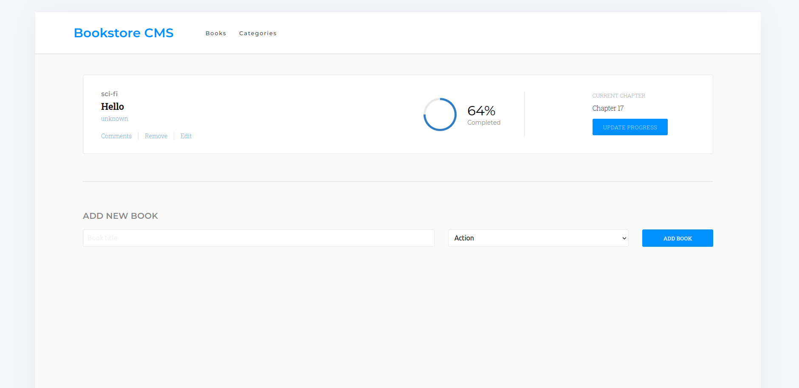

# Book Store

React application to keep track of books using Redux.

This MVP version allows you to:
- Display a list of books.
- Add a book.
- Remove a selected book.

## Built With

- CSS
- React
- Redux

## Getting Started

To get a local copy up and running follow these simple example steps.

### Setup

- Clone the repo `git clone git@github.com:Leandro-Barretoo/bookstore_app.git`
- `cd` into the directory
- run `npm i` or `npm install` to download required node_modules
- open in your desired code editor
- run `npm start` to start live server

## Authors

👤 **Leandro Barreto**

- GitHub: [@Leandro-Barretoo](https://github.com/Leandro-Barretoo)
- LinkedIn: [Leandro Barreto](https://linkedin.com/in/leandroobarreto/)

## 🤝 Contributing

Contributions, issues, and feature requests are welcome!

Feel free to check the [issues page](../../issues/).

## Show your support

Give a ⭐️ if you like this project!

## Acknowledgments

- Hat tip to anyone whose code was used
- Inspiration
- etc

## 📝 License

This project is [MIT](./MIT.md) licensed.